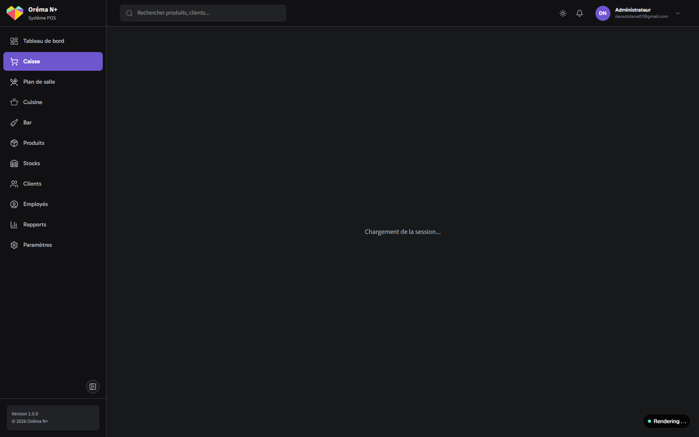

<div align="center">

# Oréma N+

**Système de Point de Vente moderne pour le marché gabonais et africain**

[](https://nextjs.org/)
[](https://react.dev/)
[](https://www.typescriptlang.org/)
[](https://supabase.com/)
[](https://v2.tauri.app/)
[](LICENSE)

[Fonctionnalités](#fonctionnalités) &bull; [Stack technique](#stack-technique) &bull; [Installation](#installation) &bull; [Mode Desktop](#mode-desktop-tauri) &bull; [Architecture](#architecture)

</div>

---

## À propos

**Oréma N+** (signifiant « le cœur » en langue locale) est un système de caisse (POS) complet conçu pour les restaurants, brasseries, maquis, bars, fast-foods et commerces du Gabon et d'Afrique centrale.

Le système prend en charge les spécificités du marché local : devise FCFA (XAF), TVA gabonaise (18%), paiements Mobile Money (Airtel Money, Moov Money), et impression thermique ESC/POS.

### Deux modes de déploiement, une seule codebase

| Mode | Commande | Usage |
|------|----------|-------|
| **Web** | `pnpm dev` | Hébergé sur Vercel, accessible via navigateur |
| **Desktop** | `pnpm tauri:dev` | Application .exe installée chez le restaurateur |

Les deux modes partagent le même backend Supabase.

## Fonctionnalités

### Module Caisse

- Vente directe, service en salle, livraison, à emporter
- Paiements multiples (espèces, carte, Mobile Money, compte client, mixte)
- Impression tickets thermiques et bons de cuisine
- Mode hors-ligne avec synchronisation automatique

### Gestion de salle

- Plan de salle interactif avec drag & drop
- Statut des tables en temps réel
- Transfert de table et division d'addition
- Zones configurables

### Produits & Stocks

- Catalogue avec catégories, suppléments et produits composites
- Gestion des stocks avec déduction automatique
- Import/export CSV
- Support codes-barres

### Rapports

- Rapport Z (clôture de caisse)
- Statistiques de ventes par période
- Analyse des produits les plus vendus et heures de pointe
- Export PDF, Excel, CSV

### Administration

- Gestion des employés avec rôles (Admin, Manager, Caissier, Serveur)
- Permissions granulaires par rôle
- Connexion rapide par code PIN
- Journal d'audit des opérations sensibles

## Screenshots

<div align="center">
<table>
<tr>
<td align="center"><strong>Interface de caisse</strong></td>
<td align="center"><strong>Commande en cours</strong></td>
</tr>
<tr>
<td></td>
<td></td>
</tr>
<tr>
<td align="center"><strong>Encaissement</strong></td>
<td align="center"><strong>Rapports</strong></td>
</tr>
<tr>
<td></td>
<td></td>
</tr>
<tr>
<td align="center"><strong>Mode sombre</strong></td>
<td align="center"><strong>Responsive tablet</strong></td>
</tr>
<tr>
<td></td>
<td></td>
</tr>
</table>
</div>

## Stack technique

| Catégorie            | Technologies                                |
| -------------------- | ------------------------------------------- |
| **Framework**        | Next.js 16 (App Router, Turbopack)          |
| **UI**               | React 19, Radix UI Themes 3, Tailwind CSS 4 |
| **Langage**          | TypeScript 5 (strict)                       |
| **Base de données**  | PostgreSQL via Supabase                     |
| **Authentification** | Supabase Auth + PIN codes (hashés)          |
| **État global**      | Zustand 5                                   |
| **État serveur**     | TanStack Query 5                            |
| **Formulaires**      | React Hook Form + Zod                       |
| **Impression**       | ESC/POS (USB, réseau, série)                |
| **Desktop**          | Tauri 2 (Rust + WebView2)                   |
| **Tests**            | Vitest (unitaires), Playwright (E2E)        |

## Installation

### Prérequis

- Node.js 20+
- pnpm 9+
- Un projet [Supabase](https://supabase.com/) (gratuit)

### Démarrage (mode Web)

```bash
# Cloner le dépôt
git clone https://github.com/Danel2025/Orema-n-.git
cd Orema-n-

# Installer les dépendances
pnpm install

# Configurer les variables d'environnement
cp .env.example .env
# Éditer .env avec vos clés Supabase

# Lancer le serveur de développement
pnpm dev
```

Ouvrir [http://localhost:3000](http://localhost:3000)

### Variables d'environnement

```env
NEXT_PUBLIC_SUPABASE_URL=https://votre-projet.supabase.co
NEXT_PUBLIC_SUPABASE_ANON_KEY=votre-cle-anon
SUPABASE_SERVICE_ROLE_KEY=votre-cle-service
AUTH_SECRET=votre-secret-jwt
```

## Mode Desktop (Tauri)

L'application peut être compilée en exécutable Windows (.exe) grâce à Tauri 2.

### Prérequis supplémentaires

1. **Visual Studio 2022 Build Tools** avec le workload "Desktop development with C++" :
   ```bash
   winget install Microsoft.VisualStudio.2022.BuildTools
   ```
   Puis ouvrir Visual Studio Installer et ajouter "Desktop development with C++".

2. **Rust** (via rustup) :
   ```bash
   winget install Rustlang.Rustup
   ```
   Redémarrer le terminal, puis vérifier :
   ```bash
   rustc --version
   cargo --version
   ```

3. **WebView2 Runtime** — préinstallé sur Windows 11. Sur Windows 10, télécharger depuis [microsoft.com](https://developer.microsoft.com/en-us/microsoft-edge/webview2/).

### Lancer en mode Desktop

```bash
# Développement (lance Next.js + Tauri)
pnpm tauri:dev

# Build de production (génère un installeur .exe)
pnpm tauri:build
```

L'installeur est généré dans `src-tauri/target/release/bundle/`.

### Configuration Tauri

| Paramètre | Valeur |
|-----------|--------|
| **Nom** | Oréma N+ |
| **Identifiant** | `com.orema.pos` |
| **Fenêtre** | 1280x800 (min 1024x768) |
| **Plein écran** | Activable |
| **Backend** | Même Supabase que le mode Web |

Le fichier de configuration se trouve dans `src-tauri/tauri.conf.json`.

## Scripts

```bash
# Développement
pnpm dev                  # Serveur dev web (Turbopack)
pnpm dev:clean            # Nettoyer le cache + serveur dev
pnpm tauri:dev            # Serveur dev desktop (Tauri)

# Build
pnpm build                # Build web de production
pnpm tauri:build          # Build desktop (.exe)

# Qualité de code
pnpm lint                 # ESLint
pnpm lint:fix             # Corriger automatiquement
pnpm format               # Prettier
pnpm check:accents        # Vérifier les accents français

# Tests
pnpm test                 # Tests unitaires (watch)
pnpm test:run             # Tests unitaires (une fois)
pnpm test:e2e             # Tests E2E Playwright

# Base de données
pnpm db:types             # Générer les types TypeScript depuis Supabase
```

## Architecture

```
gabon-pos/
├── app/                        # Next.js App Router
│   ├── (auth)/                 #   Login, register, PIN
│   ├── (dashboard)/            #   Routes protégées
│   │   ├── caisse/             #     Interface de caisse
│   │   ├── salle/              #     Plan de salle
│   │   ├── produits/           #     Gestion produits
│   │   ├── stocks/             #     Gestion stocks
│   │   ├── clients/            #     Gestion clients
│   │   ├── employes/           #     Gestion employés
│   │   ├── rapports/           #     Rapports et statistiques
│   │   ├── parametres/         #     Configuration
│   │   └── admin/              #     Administration
│   ├── (public)/               #   Pages publiques (landing, docs, blog)
│   └── api/                    #   API Routes
├── actions/                    # Server Actions (mutations)
├── components/
│   ├── ui/                     #   Composants Radix UI
│   ├── composed/               #   Composants composés
│   ├── landing/                #   Landing page
│   ├── caisse/                 #   Composants caisse
│   ├── salle/                  #   Composants plan de salle
│   └── ...                     #   Autres modules
├── lib/
│   ├── db/                     #   Couche base de données Supabase
│   ├── auth/                   #   Authentification
│   ├── print/                  #   Impression ESC/POS
│   ├── config/                 #   Plans tarifaires
│   └── design-system/          #   Utilitaires design
├── stores/                     # Zustand (cart, session, UI)
├── schemas/                    # Schémas Zod
├── types/                      # Types TypeScript
├── src-tauri/                  # Configuration Tauri (desktop .exe)
│   ├── tauri.conf.json         #   Config fenêtre, build, identifiant
│   ├── Cargo.toml              #   Dépendances Rust
│   └── src/                    #   Code Rust (main.rs, lib.rs)
├── supabase/
│   ├── migrations/             #   Migrations SQL
│   └── functions/              #   Edge Functions
├── docs/
│   ├── specs/                  #   Cahier des charges, spécifications
│   ├── guides/                 #   Guides techniques
│   ├── design/                 #   Design system
│   └── changelogs/             #   Historiques
└── tests/
    ├── unit/                   #   Tests Vitest
    └── e2e/                    #   Tests Playwright
```

## Configuration métier

| Paramètre         | Valeur                          |
| ----------------- | ------------------------------- |
| **Devise**        | XAF / FCFA (sans décimales)     |
| **TVA standard**  | 18%                             |
| **TVA réduite**   | 10%                             |
| **Timezone**      | Africa/Libreville               |
| **Langue**        | Français                        |
| **Mobile Money**  | Airtel Money, Moov Money        |
| **Format ticket** | YYYYMMDD00001 (séquentiel/jour) |

## Rôles utilisateurs

| Rôle            | Accès                                           |
| --------------- | ----------------------------------------------- |
| **Super Admin** | Accès complet, gestion multi-établissements     |
| **Admin**       | Configuration établissement, employés, rapports |
| **Manager**     | Produits, stocks, rapports, clôture de caisse   |
| **Caissier**    | Caisse, encaissements, consultation rapports    |
| **Serveur**     | Prise de commande, gestion tables               |

## Contribuer

1. Fork le projet
2. Créer une branche (`git checkout -b feature/ma-fonctionnalité`)
3. Commit les changements (`git commit -m 'feat: ajouter ma fonctionnalité'`)
4. Push la branche (`git push origin feature/ma-fonctionnalité`)
5. Ouvrir une Pull Request

## Licence

Ce projet est sous licence [MIT](LICENSE).

---

<div align="center">

**Oréma N+** — Le cœur de votre commerce

Conçu avec soin pour le Gabon et l'Afrique centrale

</div>
